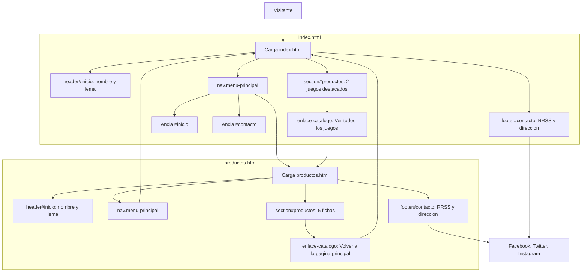
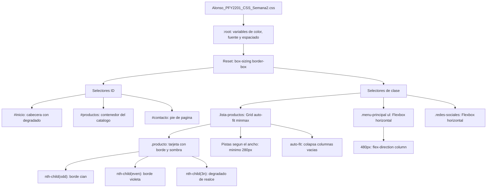

# Elite Gaming Store - Estructura HTML, CSS y layout responsivo

## Descripción

Maqueta del sitio de la tienda de videojuegos **Elite Gaming Store**. La página principal muestra una selección de dos juegos destacados, y desde el menú de navegación se accede al catálogo completo con los cinco juegos disponibles. Ambas páginas comparten la misma estructura: cabecera con el nombre y lema de la tienda, menú de navegación, sección de productos y pie de página con los enlaces a redes sociales y la dirección de la tienda.

Sobre esa estructura se aplica una hoja de estilos externa con un tema oscuro de tipo gaming: fondo azul muy oscuro, tarjetas de producto con borde y sombra, y dos colores de acento (cian y violeta) que se alternan entre los productos y resaltan los enlaces del menú. El layout se adapta a escritorio, tableta y móvil con Flexbox en el menú y el pie, y CSS Grid en el catálogo.

## Tecnologías

- **HTML5** con etiquetas semánticas (`<header>`, `<nav>`, `<section>`, `<footer>`) y `meta viewport` para el render correcto en dispositivos móviles.
- **CSS3** en una hoja externa, con variables personalizadas en `:root` y modelo de cajas (`box-sizing: border-box`).
- **Flexbox** exclusivo en `.menu-principal ul` y `.redes-sociales` (footer) para alinear enlaces en fila.
- **CSS Grid** en `.lista-productos` con `repeat(auto-fit, minmax(280px, 1fr))` para que las tarjetas llenen el ancho disponible sin dejar columnas vacías.
- **Media queries** en `max-width: 768px` (tableta) y `max-width: 480px` (móvil); el escritorio usa los estilos base.
- Navegación mediante enlaces entre páginas y anclajes internos (`id`) hacia las secciones de inicio, productos y contacto.
- Atributos `alt` en todas las imágenes para cumplir con los estándares de accesibilidad web.

## Estructura del proyecto

```
EliteGamingStore/
├── index.html
├── productos.html
├── Alonso_PFY2201_CSS_Semana2.css
├── README.md
├── images/
│   ├── juego1.jpg
│   ├── juego2.jpg
│   ├── juego3.jpg
│   ├── juego4.jpg
│   └── juego5.jpg
└── entregables/
    ├── Alonso_Basualdo_Semana1_PFY2201.docx
    ├── Alonso_Basualdo_Semana2_PFY2201.docx
    └── Alonso_Basualdo_Semana3_PFY2201.docx
```

Las imágenes de los productos están en `images/` y se referencian con rutas relativas (por ejemplo, `images/juego1.jpg`). La hoja de estilos vive en la raíz porque el nombre del archivo forma parte de la entrega del curso. La carpeta `entregables/` guarda los informes Word de cada semana.

## Páginas

| Archivo | Contenido |
| --- | --- |
| `index.html` | Página principal con dos juegos destacados y enlace al catálogo completo. |
| `productos.html` | Catálogo completo con los cinco juegos de la tienda. |
| `Alonso_PFY2201_CSS_Semana2.css` | Hoja de estilos compartida (Semana 2 en adelante: paleta, Grid, Flexbox y media queries). |
| `entregables/` | Informes Word de las Semanas 1, 2 y 3. |

Las dos páginas enlazan la misma hoja desde su `<head>` y declaran el viewport:

```html
<meta name="viewport" content="width=device-width, initial-scale=1.0">
<link rel="stylesheet" href="Alonso_PFY2201_CSS_Semana2.css">
```

## Flujo de la página



## Hoja de estilos

### Variables en `:root`

| Variable | Valor | Uso |
| --- | --- | --- |
| `--color-fondo` | `#0d1117` | Fondo de la página y de las tarjetas |
| `--color-superficie` | `#161b22` | Fondo de header, nav, section y footer |
| `--color-borde` | `#30363d` | Bordes de bloques y botones del menú |
| `--color-texto` | `#e6edf3` | Texto principal |
| `--color-texto-suave` | `#c8ccd1` | Párrafos y descripciones |
| `--color-acento` | `#00e5ff` | Cian: títulos, enlaces y productos impares |
| `--color-acento-2` | `#b026ff` | Violeta: hover, footer y productos pares |

Se suman `--fuente-base` (pila sans-serif encabezada por Segoe UI), `--espacio` (`1rem`) y `--radio` (`10px`) para mantener espaciados y esquinas consistentes.

### Modelo de cajas

- Reset global con `box-sizing: border-box` y `margin`/`padding` en cero.
- `body` centrado con `max-width: 1100px` y `margin: 0 auto`.
- `header`, `nav`, `section` y `footer` comparten `padding: 2rem 1.5rem` y `margin-bottom: 2rem`.
- Cada producto es una tarjeta con `padding`, `border`, `border-radius` y `box-shadow`.
- Las imágenes usan `max-width: 100%` y `height: auto` para no desbordar en pantallas chicas.

### Selectores utilizados

| Tipo | Selectores | Efecto |
| --- | --- | --- |
| ID | `#inicio`, `#productos`, `#contacto` | Degradado en la cabecera, espaciado del catálogo y borde superior del pie |
| Clase | `.menu-principal`, `.lista-productos`, `.producto`, `.enlace-catalogo`, `.redes-sociales` | Flexbox en el menú, Grid en el catálogo, tarjetas, botón de catálogo y Flexbox en redes |
| Pseudo-clase | `:nth-child(odd)`, `:nth-child(even)`, `:nth-child(3n)`, `:hover`, `:focus` | Bordes alternados cian y violeta, realce cada tercer producto y estados interactivos |

### Comportamiento responsive

La grilla de productos no fija un número de columnas: `repeat(auto-fit, minmax(280px, 1fr))` crea tantas pistas como quepan (mínimo 280px) y colapsa las vacías, de modo que las dos tarjetas de `index.html` ocupan todo el ancho.

| Ancho | Dispositivo | Layout |
| --- | --- | --- |
| Mayor a 768px | Escritorio (estilos base) | Grid dinámico (`auto-fit` / `minmax`); menú y RRSS en fila (Flexbox) |
| `max-width: 768px` | Tableta | El Grid se adapta solo; paddings intermedios; `h1` a 2.1rem |
| `max-width: 480px` | Móvil | Una columna cuando el contenedor baja de 280px; menú en columna (`flex-direction: column`); `h1` a 1.6rem |



## Cambios en el HTML

El contenido visible de la Semana 1 no se reescribió: no se modificó ningún texto ni ninguna etiqueta semántica. Sobre esa base se añadieron:

| Incorporación | Dónde |
| --- | --- |
| `meta viewport` | `<head>` de `index.html` y `productos.html` (Semana 3) |
| `<link rel="stylesheet">` | `<head>` de ambas páginas, apunta a `Alonso_PFY2201_CSS_Semana2.css` |
| `class="menu-principal"` | `<nav>` del menú |
| `class="lista-productos"` | `<ul>` que agrupa los productos |
| `class="producto"` | Cada `<li>` de producto |
| `class="enlace-catalogo"` | Enlace al catálogo y enlace de regreso a inicio |
| `class="redes-sociales"` | `<ul>` de redes sociales del footer |

Los identificadores `#inicio`, `#productos` y `#contacto` ya existían en el HTML original y se reutilizaron como selectores.

## Catálogo de productos

| Juego | Imagen | Aparece en |
| --- | --- | --- |
| The Legend of Zelda: Breath of the Wild | `images/juego1.jpg` | Portada y catálogo |
| God of War Ragnarök | `images/juego2.jpg` | Portada y catálogo |
| Cyberpunk 2077 | `images/juego3.jpg` | Catálogo |
| The Witcher 3: Wild Hunt | `images/juego4.jpg` | Catálogo |
| The Last of Us Part II | `images/juego5.jpg` | Catálogo |

## Datos de contacto

Estos datos son ficticios y deben ser idénticos en el footer de ambas páginas:

- **Dirección:** Av. Libertad 15554, Valparaíso, Chile
- **Redes sociales:** Facebook, Twitter e Instagram

## Uso

Abrir el archivo `index.html` en cualquier navegador web moderno y navegar hacia `productos.html` desde el menú. La hoja de estilos se carga automáticamente por ruta relativa, sin necesidad de un servidor local.

## Contexto académico

Curso **Desarrollo Frontend I (PFY2201)**:

- **Semana 1:** estructura y semántica HTML de ambas páginas. Informe: `entregables/Alonso_Basualdo_Semana1_PFY2201.docx`.
- **Semana 2:** hoja `Alonso_PFY2201_CSS_Semana2.css` con variables, modelo de cajas y selectores avanzados (`nth-child`, `:hover`). Informe: `entregables/Alonso_Basualdo_Semana2_PFY2201.docx`.
- **Semana 3:** layout responsivo con Flexbox en nav y footer, CSS Grid dinámico (`auto-fit` / `minmax`) en el catálogo, `meta viewport` y media queries a 768px y 480px. Informe: `entregables/Alonso_Basualdo_Semana3_PFY2201.docx`.
