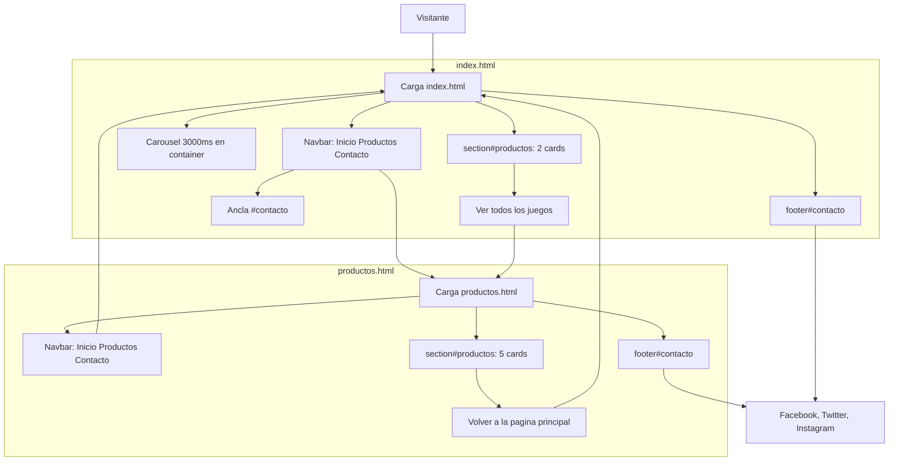

# Elite Gaming Store - Bootstrap 5

## Descripción

Maqueta del sitio de la tienda de videojuegos **Elite Gaming Store**. Sigue siendo un sitio de **dos páginas**: la principal (`index.html`) muestra un carrusel y dos juegos destacados; el catálogo (`productos.html`) lista los cinco títulos. Ambas comparten navbar, pie de contacto y el mismo tema oscuro.

## Migración de la estructura antigua

Hasta la Semana 3 el layout dependía de HTML propio más la hoja `Alonso_PFY2201_CSS_Semana2.css`: variables en `:root`, Flexbox en `.menu-principal` y `.redes-sociales`, CSS Grid (`auto-fit` / `minmax`) en `.lista-productos` y media queries a 768px y 480px. Las páginas enlazaban esa hoja así:

```html
<link rel="stylesheet" href="Alonso_PFY2201_CSS_Semana2.css">
```

En la Semana 4 esa arquitectura se **reemplazó** en `index.html` y `productos.html`:

| Antes (Semanas 1–3) | Ahora (Semana 4) |
| --- | --- |
| CSS propio en la raíz | Bootstrap 5.3 por CDN (CSS + JS) |
| Clases `.menu-principal`, `.lista-productos`, `.producto` | Navbar, grid (`container` / `row` / `col-*`) y `card` nativos |
| Flexbox y Grid escritos a mano | Sistema de cuadrículas y utilidades de Bootstrap |
| Media queries propias | Puntos de corte `col-12`, `col-md-6`, `col-lg-4` y `navbar-expand-lg` |
| Tema oscuro en variables CSS | `data-bs-theme="dark"` en `<html>` |

La hoja `Alonso_PFY2201_CSS_Semana2.css` **no se borra** (sigue siendo la entrega de Semana 2), pero **ya no se vincula**. Un prototipo de una sola página (`Alonso_PFY2201_Bootstrap_Semana4.html`) sirvió de ensayo y se movió a `Planes_Fronted` en el escritorio; el sitio real permanece en dos archivos HTML.

## Tecnologías

- **HTML5** semántico (`<header>`, `<main>`, `<nav>`, `<section>`, `<footer>`) y `meta viewport`.
- **Bootstrap 5.3.3** por CDN oficial (jsDelivr), con el bundle JS en el `<head>`.
- **Tema oscuro nativo** (`data-bs-theme="dark"`).
- Navbar con botón hamburguesa (`navbar-toggler`) en viewports menores a `lg`.
- Carrusel automático solo en inicio (`data-bs-interval="3000"`), contenido en `container`.
- Cards de producto con brillo violeta (`.card-img-top`); el carrusel usa un glow cian.
- Navegación entre páginas (`index.html` / `productos.html`) y ancla `#contacto` al footer.
- Atributos `alt` en todas las imágenes.

## Estructura del proyecto

```
EliteGamingStore/
├── index.html
├── productos.html
├── Alonso_PFY2201_CSS_Semana2.css   (histórico; no se enlaza)
├── README.md
├── images/
│   ├── juego1.jpg
│   ├── juego2.jpg
│   ├── juego3.jpg
│   ├── juego4.jpg
│   └── juego5.jpg
├── css/
├── js/
└── entregables/
    ├── Alonso_Basualdo_Semana1_PFY2201.docx
    ├── Alonso_Basualdo_Semana2_PFY2201.docx
    └── Alonso_Basualdo_Semana3_PFY2201.docx
```

Las imágenes se referencian con rutas relativas (`images/juego1.jpg`). Las carpetas `css/` y `js/` quedan reservadas; el estilo y el comportamiento de Bootstrap llegan por CDN.

## Páginas

| Archivo | Contenido |
| --- | --- |
| `index.html` | Navbar, carrusel de los 5 juegos, 2 cards destacadas (`col-12 col-md-6`) y enlace al catálogo. |
| `productos.html` | Navbar, catálogo de 5 cards (`col-12 col-md-6 col-lg-4`, `h-100`) y enlace de regreso. Sin carrusel. |
| `Alonso_PFY2201_CSS_Semana2.css` | Hoja histórica de Semanas 2–3. Ya no forma parte del render actual. |
| `entregables/` | Informes Word de las Semanas 1, 2 y 3. |

Enlace típico en el `<head>` actual:

```html
<html lang="es" data-bs-theme="dark">
<link href="https://cdn.jsdelivr.net/npm/bootstrap@5.3.3/dist/css/bootstrap.min.css" rel="stylesheet">
<script src="https://cdn.jsdelivr.net/npm/bootstrap@5.3.3/dist/js/bootstrap.bundle.min.js"></script>
```

## Flujo de la página



## Layout Bootstrap

### Navbar (ambas páginas)

- `navbar navbar-expand-lg navbar-dark bg-dark` con marca **EliteGamingStore**.
- Contenido interno envuelto en `<div class="container">` para alinear logo y enlaces con el catálogo.
- Inicio → `index.html`, Productos → `productos.html`, Contacto → `#contacto`.
- `aria-current="page"` en el enlace de la página activa.

### Carrusel (`index.html`)

- Envuelto en `<div class="container mb-4">`.
- `object-fit: contain`, altura 400px y `filter` cian en las imágenes del slide.
- Cinco slides: `images/juego1.jpg` … `images/juego5.jpg`.

### Catálogo (cards)

| Página | Columnas | Juegos |
| --- | --- | --- |
| `index.html` | `col-12 col-md-6` | Zelda y God of War |
| `productos.html` | `col-12 col-md-6 col-lg-4` | Los cinco, con `h-100` |

Las portadas de las cards usan:

```css
.card-img-top {
    filter: drop-shadow(0 0 10px #b026ff);
}
```

### Footer

`footer#contacto` con `bg-dark text-light` y un `container d-flex` para RRSS y la dirección.

## Catálogo de productos

| Juego | Imagen | Aparece en |
| --- | --- | --- |
| The Legend of Zelda: Breath of the Wild | `images/juego1.jpg` | Carrusel, portada y catálogo |
| God of War Ragnarök | `images/juego2.jpg` | Carrusel, portada y catálogo |
| Cyberpunk 2077 | `images/juego3.jpg` | Carrusel y catálogo |
| The Witcher 3: Wild Hunt | `images/juego4.jpg` | Carrusel y catálogo |
| The Last of Us Part II | `images/juego5.jpg` | Carrusel y catálogo |

## Datos de contacto

Estos datos son ficticios y deben ser idénticos en el footer de ambas páginas:

- **Dirección:** Av. Libertad 15554, Valparaíso, Chile
- **Redes sociales:** Facebook, Twitter e Instagram

## Uso

Abrir `index.html` en un navegador moderno. Bootstrap se carga desde el CDN (hace falta conexión a internet). La navegación hacia `productos.html` es por ruta relativa; no se necesita servidor local.

## Contexto académico

Curso **Desarrollo Frontend I (PFY2201)**:

- **Semana 1:** estructura y semántica HTML de ambas páginas. Informe: `entregables/Alonso_Basualdo_Semana1_PFY2201.docx`.
- **Semana 2:** hoja `Alonso_PFY2201_CSS_Semana2.css` con variables, modelo de cajas y selectores avanzados. Informe: `entregables/Alonso_Basualdo_Semana2_PFY2201.docx`.
- **Semana 3:** layout responsivo propio (Flexbox, Grid, viewport, media queries). Informe: `entregables/Alonso_Basualdo_Semana3_PFY2201.docx`.
- **Semana 4:** migración a Bootstrap 5 en `index.html` y `productos.html` (navbar, carrusel, cards, tema oscuro). La hoja de Semana 2 queda como archivo histórico.
