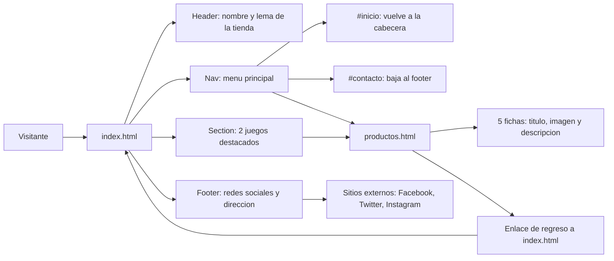

# Elite Gamming Store - Estructura Básica HTML

## Descripción

Maqueta del sitio de la tienda de videojuegos **Elite Gamming Store**. La página principal muestra una selección de dos juegos destacados, y desde el menú de navegación se accede al catálogo completo con los cinco juegos disponibles. Ambas páginas comparten la misma estructura: cabecera con el nombre y lema de la tienda, menú de navegación, sección de productos y pie de página con los enlaces a redes sociales y la dirección de la tienda.

## Tecnologías

- **HTML5** únicamente, utilizando etiquetas semánticas (`<header>`, `<nav>`, `<section>`, `<footer>`).
- Sin CSS ni JavaScript: el enfoque está exclusivamente en la estructura y la semántica del documento.
- Navegación mediante enlaces entre páginas y anclajes internos (`id`) hacia las secciones de inicio, productos y contacto.
- Atributos `alt` en todas las imágenes para cumplir con los estándares de accesibilidad web.

## Estructura del proyecto

```
EliteGamingStore/
├── index.html
├── productos.html
├── README.md
├── images/
│   ├── juego1.jpg
│   ├── juego2.jpg
│   ├── juego3.jpg
│   ├── juego4.jpg
│   └── juego5.jpg
├── css/
└── js/
```

Las imágenes de los productos se encuentran en la carpeta `images/` y se referencian con rutas relativas (por ejemplo, `images/juego1.jpg`). Las carpetas `css/` y `js/` están reservadas para las siguientes etapas del curso.

## Páginas

| Archivo | Contenido |
| --- | --- |
| `index.html` | Página principal con dos juegos destacados y enlace al catálogo completo. |
| `productos.html` | Catálogo completo con los cinco juegos de la tienda. |

## Flujo de la página



## Catálogo de productos

| Juego | Imagen | Aparece en |
| --- | --- | --- |
| The Legend of Zelda: Breath of the Wild | `images/juego1.jpg` | Portada y catálogo |
| God of War Ragnarök | `images/juego2.jpg` | Portada y catálogo |
| Cyberpunk 2077 | `images/juego3.jpg` | Catálogo |
| The Witcher 3: Wild Hunt | `images/juego4.jpg` | Catálogo |
| The Last of Us Part II | `images/juego5.jpg` | Catálogo |

## Datos de contacto

Estos datos son ficticios y deben ser idénticos en el footer de ambas páginas:

- **Dirección:** Av. Libertad 15554, Valparaíso, Chile
- **Redes sociales:** Facebook, Twitter e Instagram

## Uso

Abrir el archivo `index.html` en cualquier navegador web moderno y navegar hacia `productos.html` desde el menú.

## Contexto académico

Actividad de la Semana 1 del curso **Desarrollo Frontend I (PFY2201)**.
