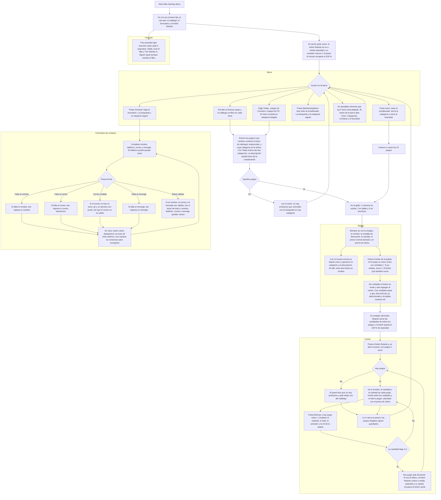

# Elite Gaming Store

Elite Gaming Store es una página con catálogo de videojuegos, filtro, carrito y formulario de contacto.

## Barra

La barra incluye el enlace **Inicio**, el menú de categorías (Todas, Juegos de Consola y Juegos de PC), el enlace **Contacto** y el buscador. El catálogo se filtra por el texto y la categoría a la vez. **Inicio** vuelve al encabezado, deja la categoría en blanco y vacía el buscador, así que vuelven a verse todos los juegos. **Contacto** baja hasta el formulario de contacto.

## Catálogo

Catálogo de videojuegos en **React** con **Vite**. La portada muestra un carrusel de tres destacados fijos. El catálogo se carga aparte, desde `public/juegos.json`.

Cada juego tiene nombre, descripción, imagen, categoría, valoración, precio normal, porcentaje de descuento y precio de oferta. El precio de oferta es el precio normal con ese descuento ya aplicado. La tarjeta muestra el porcentaje en una medalla, la valoración con una estrella y el precio normal tachado junto al de oferta. La categoría y la descripción aparecen solo al pasar el mouse sobre la tarjeta.

Si no hay coincidencias con la búsqueda y la categoría, aparece un aviso. Ese mismo aviso se ve un instante al entrar, mientras `juegos.json` todavía no llega. Si el archivo no se puede leer, la alerta roja queda fija sobre el catálogo y el aviso de búsqueda vacía permanece, porque la lista de juegos sigue vacía.

## Carrito

Un botón flotante abre el panel lateral del carrito. Su contador suma las cantidades de los juegos. El total a pagar multiplica el precio de oferta de cada juego por su cantidad.

Si el juego ya está en el carrito, se suma 1 a su cantidad y el título muestra el volumen (por ejemplo, x3). En la tarjeta, el botón pasa a **Artículo ya seleccionado** y muestra esa cantidad (por ejemplo, x2). Eliminar resta 1 y, al llegar a 0, quita el juego y el botón de la tarjeta vuelve a **Agregar al carrito**. Con el carrito vacío, el botón flotante se ve a media opacidad y recupera el 100 % al pasar el mouse o cuando hay al menos un producto.

## Formulario de contacto

Debajo del catálogo, el formulario pide nombre, teléfono, correo y mensaje. El teléfono puede quedar vacío. Si falta el nombre, el correo o el mensaje, o si el correo no es válido, aparece un error y los campos se conservan. Cuando el nombre, el correo y el mensaje son válidos, aparece el aviso de éxito y los cuatro campos quedan vacíos.

## Flujo del cliente

Recorrido de quien usa la tienda. La barra, el carrusel, el catálogo, el carrito y el formulario están en la misma página y se pueden usar en cualquier orden.


```mermaid
flowchart TD
  entra["Abre Elite Gaming Store"] --> ve["Ve a la vez la barra fija, el carrusel, el catálogo, el formulario y el botón flotante"]
  ve --> tenue["El carrito parte vacío: el botón flotante se ve a media opacidad y su contador marca 0. Al pasar el mouse recupera el 100 %"]

  subgraph destacados ["Carrusel"]
    rota["Tres portadas fijas avanzan solas cada 3 segundos: Zelda, God of War y The Witcher 3. Siguen igual aunque cambie el filtro"]
  end
  ve --> rota

  subgraph navegacion ["Barra"]
    accion{"Acción en la barra"}
    busca["Escribe en Buscar juego y el catálogo se filtra en cada tecla"]
    menu["Elige Todas, Juegos de Consola o Juegos de PC. El menú muestra la categoría elegida"]
    inicio["Pulsa Inicio: sube al encabezado, borra la categoría y vacía el buscador"]
    marca["Pulsa EliteGamingStore: solo sube al encabezado. La búsqueda y la categoría siguen"]
    contactoLink["Pulsa Contacto: baja al formulario. La búsqueda y la categoría siguen"]
    movil["En pantallas menores que lg el menú está plegado. El botón de la barra abre Inicio, Categorías, Contacto y el buscador"]
  end

  tenue --> accion
  accion --> busca
  accion --> menu
  accion --> inicio
  accion --> marca
  accion --> contactoLink
  accion --> movil
  movil --> accion

  busca --> regla["Entran los juegos cuyo nombre contiene el texto, sin distinguir mayúsculas, y cuya categoría es la activa. Con Todas entran las dos categorías. La descripción queda fuera de la comparación"]
  menu --> regla
  inicio --> completo["Vuelven a verse los 10 juegos"]
  regla --> hay{"Quedan juegos"}
  hay -->|"No"| aviso["Lee el aviso: no hay productos que coincidan con la búsqueda en esa categoría"]
  hay -->|"Sí"| grilla["Ve la grilla: 1 columna en celular, 2 en tablet y 3 en escritorio"]
  aviso --> accion
  completo --> grilla

  subgraph tarjeta ["Tarjeta"]
    siempre["Siempre se ven la imagen, el nombre, la medalla de descuento, la estrella, el precio normal tachado y el precio de oferta"]
    hover["Con el mouse encima la tarjeta crece y aparecen la categoría y la descripción. Al salir, esas dos líneas se ocultan"]
    clic["Pulsa el botón de la tarjeta. Si el juego es nuevo entra con cantidad 1. Si ya estaba, suma 1. El botón gris también suma"]
    estadoBtn["Sin unidades el botón es verde y dice Agregar al carrito. Con unidades pasa a gris, dice Artículo ya seleccionado y la tarjeta muestra xN"]
  end

  grilla --> siempre
  siempre --> hover
  siempre --> clic
  clic --> estadoBtn
  estadoBtn --> contador["El contador del botón flotante suma las cantidades de todos los juegos y el botón queda al 100 % de opacidad"]

  subgraph carritoBox ["Carrito"]
    abre["Pulsa el botón flotante y se abre el panel, con juegos o vacío"]
    sinItems{"Hay juegos"}
    msgVacio["El panel dice que no hay productos y pide elegir uno del catálogo"]
    lista["Ve el nombre, la cantidad y el subtotal de cada juego. Arriba están las unidades y el total a pagar, calculado con el precio de oferta"]
    elimina["Pulsa Eliminar y ese juego resta 1. Cambian el subtotal, el total, el contador y la xN de la tarjeta"]
    aCero{"La cantidad llegó a 0"}
    fuera["Ese juego sale del panel. Si era el último, el botón flotante vuelve a media opacidad y su tarjeta recupera el botón verde"]
    cerrar["La X cierra el panel y los juegos elegidos siguen guardados"]
  end

  contador --> abre
  abre --> sinItems
  sinItems -->|"No"| msgVacio
  sinItems -->|"Sí"| lista
  msgVacio --> cerrar
  lista --> elimina
  lista --> cerrar
  elimina --> aCero
  aCero -->|"No"| lista
  aCero -->|"Sí"| fuera
  fuera --> sinItems
  cerrar --> accion

  subgraph formulario ["Formulario de contacto"]
    campos["Completa nombre, teléfono, correo y mensaje. El teléfono puede quedar vacío"]
    enviar{"Pulsa Enviar"}
    eNombre["Si falta el nombre, lee: Ingresa tu nombre"]
    eCorreoVacio["Si falta el correo, lee: Ingresa tu correo electrónico"]
    eCorreoMal["Si el correo no trae un texto, @ y un dominio con punto, lee que el correo no es válido"]
    eMensaje["Si falta el mensaje, lee: Ingresa un mensaje"]
    conserva["En esos cuatro casos desaparece un aviso de éxito anterior y los campos se conservan para corregirlos"]
    exito["Si el nombre, el correo y el mensaje son válidos, lee el aviso de éxito y nombre, teléfono, correo y mensaje quedan vacíos"]
  end

  contactoLink --> campos
  campos --> enviar
  enviar -->|"Falta el nombre"| eNombre
  enviar -->|"Falta el correo"| eCorreoVacio
  enviar -->|"Correo inválido"| eCorreoMal
  enviar -->|"Falta el mensaje"| eMensaje
  eNombre --> conserva
  eCorreoVacio --> conserva
  eCorreoMal --> conserva
  eMensaje --> conserva
  conserva --> campos
  enviar -->|"Datos válidos"| exito
```

## Flujo del proyecto

Recorrido de los datos desde el montaje. `App` guarda el catálogo, el filtro y el carrito. `HeroCarousel` usa tres imágenes fijas. `ContactForm` guarda su propio estado y no lee `juegos.json`.

```mermaid
flowchart TD
  subgraph arranque ["Arranque"]
    html["index.html deja div#root y data-bs-theme dark"]
    mainjsx["main.jsx crea la raíz, importa Bootstrap y styles.css, y monta App dentro de StrictMode"]
    estado["El estado inicial de App: productos vacío, error nulo, carrito vacío, carritoAbierto en false, busqueda vacía y categoriaActiva vacía"]
    primera["El primer render pinta NavbarTienda, HeroCarousel, Cart cerrado, el aviso de catálogo vacío, ContactForm, el pie y el botón flotante"]
  end

  html --> mainjsx --> estado --> primera

  subgraph carga ["Carga del catálogo"]
    efecto["useEffect con dependencias vacías hace fetch de BASE_URL + juegos.json con cache no-store"]
    respuesta{"respuesta.ok"}
    falla["catch llama a setError. Se pinta la alerta roja fija y, como productos sigue vacío, también el aviso de búsqueda sin resultados"]
    guarda["setProductos guarda los 10 juegos: id, nombre, descripcion, imagen, categoria, valoracion, precioNormal, descuento y precioOferta"]
  end

  estado --> efecto --> respuesta
  respuesta -->|"No"| falla
  respuesta -->|"Sí"| guarda

  subgraph filtro ["Filtro en cada render de App"]
    texto["termino es busqueda en minúsculas y sin espacios en los bordes"]
    filtra["productosFiltrados deja el juego si nombre incluye termino y categoriaActiva está vacía o es igual a juego.categoria"]
    origen["NavbarTienda recibe busqueda, setBusqueda, categoriaActiva y setCategoriaActiva. El input escribe en cada cambio. Cada ítem del menú llama a setCategoriaActiva y hace preventDefault"]
    reset["volverAlInicio, usado solo por el enlace Inicio, pone categoría y búsqueda en texto vacío. La marca y Contacto solo navegan a su ancla"]
    pintado{"productosFiltrados.length es mayor que 0"}
    aviso["Se renderiza la alerta secundaria de búsqueda sin resultados"]
    map["map crea una ProductCard por juego. find busca el id en carrito y pasa yaSeleccionado y cantidad"]
  end

  guarda --> texto --> filtra
  origen --> filtra
  reset --> filtra
  filtra --> pintado
  pintado -->|"No"| aviso
  pintado -->|"Sí"| map

  subgraph card ["ProductCard"]
    ruta["La ruta de la imagen es BASE_URL más producto.imagen, quitando el prefijo public y la barra inicial"]
    local["detalleVisible es un useState local que parte en false. onMouseEnter lo pone en true y onMouseLeave en false"]
    cond["Con detalleVisible se renderizan categoria y descripcion. Con yaSeleccionado se renderiza x cantidad y el botón usa btn-secondary. Si no, el botón usa btn-success"]
    click["onClick llama a agregarAlCarrito con el producto también cuando el botón ya dice Artículo ya seleccionado"]
  end

  map --> ruta --> local --> cond --> click

  subgraph estadoCarrito ["Carrito"]
    agregar{"El id ya está en carrito"}
    suma["map copia el arreglo y a ese id le suma 1 en cantidad"]
    nuevo["El spread agrega una copia del producto con cantidad 1"]
    props["El render siguiente recalcula yaSeleccionado y cantidad solo para las tarjetas que siguen en productosFiltrados"]
    flotante["El botón flotante reduce las cantidades para el Badge. Con carrito.length en 0 agrega btn-carrito-vacio. onClick pone carritoAbierto en true"]
    off["Cart recibe carrito, eliminarDelCarrito, abierto y cerrarCarrito. Offcanvas usa show igual a abierto y placement end"]
    cuentas["unidades suma las cantidades. total suma precioOferta por cantidad y formatoPrecio lo muestra en es-CL"]
    vacioCart{"carrito.length es 0"}
    msg["Se renderiza la alerta de carrito vacío"]
    items["Se renderiza la lista con nombre, cantidad, subtotal y el botón Eliminar"]
    restar["eliminarDelCarrito hace map para restar 1 a ese id y filter deja solo los ítems con cantidad mayor que 0"]
    cierre["onHide llama a cerrarCarrito y carritoAbierto vuelve a false"]
  end

  click --> agregar
  agregar -->|"Sí"| suma
  agregar -->|"No"| nuevo
  suma --> props
  nuevo --> props
  props --> cond
  suma --> flotante
  nuevo --> flotante
  flotante --> off --> cuentas --> vacioCart
  vacioCart -->|"Sí"| msg
  vacioCart -->|"No"| items
  items --> restar
  restar --> props
  restar --> cuentas
  off --> cierre

  subgraph form ["ContactForm"]
    propio["Su estado es enviado en false y error en texto vacío. Los cuatro inputs se leen del DOM y no tienen value"]
    submit["onSubmit previene el envío nativo, hace trim de nombre, email y mensaje, y revisa en este orden"]
    orden{"Resultado de manejarEnvio"}
    n1["Sin nombre: setEnviado false y error Ingresa tu nombre"]
    n2["Sin correo: error Ingresa tu correo electrónico"]
    n3["Correo fuera del patrón texto, arroba y dominio con punto: error de correo no válido"]
    n4["Sin mensaje: error Ingresa un mensaje"]
    okForm["Si nombre, correo y mensaje pasan: setError vacío, setEnviado true, alerta verde y formulario.reset, que también limpia el teléfono"]
  end

  primera --> propio --> submit --> orden
  orden -->|"Falta nombre"| n1
  orden -->|"Falta correo"| n2
  orden -->|"Correo inválido"| n3
  orden -->|"Falta mensaje"| n4
  orden -->|"Válido"| okForm
  n1 --> propio
  n2 --> propio
  n3 --> propio
  n4 --> propio
```

## Tecnologías

- React 19 y Vite
- Bootstrap 5.3 y react-bootstrap
- Tema oscuro: `data-bs-theme="dark"` en `index.html`

## Uso

```bash
npm install
npm run dev
```

Abrir la URL que imprime Vite. Con la base del proyecto queda en `http://localhost:5173/EliteGamingStore/`.

## Publicación

El sitio publicado vive en [https://l0ncho.github.io/EliteGamingStore/](https://l0ncho.github.io/EliteGamingStore/). `npm run deploy` compila y sube solo la carpeta `dist` a la rama `gh-pages`.

## EVIDENCIA

### 1. Estados del carrito y del  boton

useState guarda el catálogo y el carrito. Agregar el mismo juego otra vez suma 1 a su cantidad. El botón de la tarjeta es el elemento interactivo: pasa de Agregar al carrito a Artículo ya seleccionado cuando ese juego ya está en el estado del carrito.


### 2. Datos cargados con useEffect
useEffect carga public/juegos.json al montar la aplicación y guarda el resultado en el estado del catálogo. Las tarjetas muestran nombre, descuento, valoración y precios que vienen de ese archivo, no de una lista fija en el componente.


### 3. Tres condicionales
A) Mensaje del carrito, estado del boton flotante
Si el carrito está vacío, no se renderiza la lista. Se muestra el mensaje de carrito vacío y el botón flotante usa el estilo de menor opacidad.


B) Estilo del botón
El mismo botón cambia de texto y de clase según el estado. Verde si el juego no está en el carrito y gris si ya está seleccionado.


C) Vista al pasar el mouse.
La categoría y la descripción se renderizan únicamente cuando el mouse está sobre la tarjeta. Al salir, esa vista se oculta y quedan el título, la valoración, el precio y el botón.


### 4. Diseño Responsivo
Toda la interfaz fue construida para adaptarse a cualquier tamaño de pantalla, redistribuyendo el catálogo y transformando el menú principal en dispositivos móviles y tablets.


## Contacto


Datos ficticios:

- Dirección: Av. Libertad 15554, Valparaíso, Chile
- Redes: Facebook, Twitter e Instagram

## Curso

**Desarrollo Frontend I (PFY2201).** La app es React + Vite: catálogo con Fetch, descuentos por juego, filtro, carrito con cantidades y formulario de contacto.
